# hands-on-lab-askHR

## Table of Contents

- Use Case description
- Architecture
- Pre-requisites
- Instructions
    - Open Agent Builder
    - Create HR Agent
    - Test HR Agent in preview
    - Test HR Agent in AI Chat
    - Review Domain Agents and Tools (Optional)
    - Test the SAP Employee Support Manager agent (Optional)

## Use Case Description

This use case targets developing and deploying an AskHR agent leveraging IBM watsonx Orchestrate, as depicted in the provided architecture diagram. This agent will empower employees to interact with HR systems and access information efficiently through conversational AI.

In this lab we will build an HR agent in watsonx Orchestrate, leveraging tools and external knowledge to connect to a simulated Human Capital Management System. This agent retrieves relevant information from documents to answer user queries and allows users to view and manage their profiles.

Additionaly, IBM watsonx Orchestrate provides an easy access to pre-built domain agents and tools, including those in the HR domain, for example SAP Successfactors, Oracle HCM, and Workday. Agents can be created from a template in one click, then modified and extended as needed. This optinal part of the lab will give you access to the SAP Employee Support Manager Agent that you can see in action by testing out with a few sample queries.

In a real enterprise scenario it is recommended to start with pre-built domain agents and tools. You can easily create your own agent from an existing template and then modify and extend as needed, for example bringing in additional tools, agents, and connections.

## Architecture

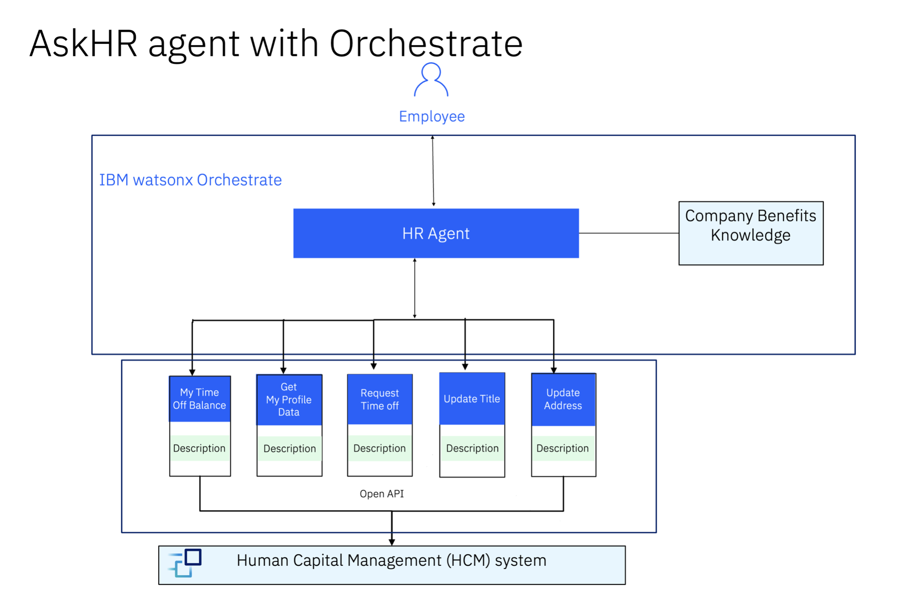

## Pre-requisites

**Instructors**:
- Check the corresponding [Instructor’s guide](https://github.ibm.com/skol/agentic-ai-client-bootcamp-instructors/tree/main/usecase-setup/askhr) repo to set up all environments and backend services.
> NOTE: the `main` branch contains the latest release code. If you want to use a previous release, download the same [release](https://github.ibm.com/skol/agentic-ai-client-bootcamp-instructors/releases) that will be used for participants’ lab.
- Ensure you have provided an updated OpenAPI Spec located in the instructor repo at `usecase-setup/askhr/HCM_APP/hr.yaml` with the correct URL to your deployed backend service for the lab participants.
- Provide the [list of employees](https://github.ibm.com/skol/agentic-ai-client-bootcamp-instructors/blob/main/usecase-setup/askhr/HCM_APP/users_data.xlsx) and assign one to each student for testing.
- Ensure you have set up a shared watsonx Orchestrate tenant and configured the SAP connections (optional part)

**Participants**:
- Validate that you have access to the right TechZone environment for this lab
- Validate that you have access to the shared wxO tenant (provided by instructor) for the domain agent part (optional)
- Complete the [environment-setup](../../../environment-setup) guide for steps on API key creation and project setup.
- Validate that you have access to a credentials file that your instructor will share with you before starting the labs
- Familiarity with AI agent concepts (e.g., instructions, tools, collaborators…)
- Make sure that your instructor has provided the following:
- updated **hr.yaml OpenAPI Spec**

## Instructions

### Open Agent Builder

- Log in to IBM Cloud (cloud.ibm.com). Navigate to top left hamburger menu, then to Resource List. Open the AI/Machine Learning section. You should see a **watsonx Orchestrate** service, click to open.
    
    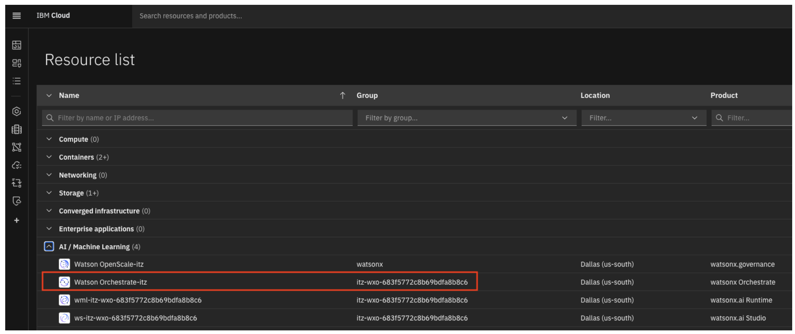
    
- Click the “Launch watsonx Orchestrate” button.
    
    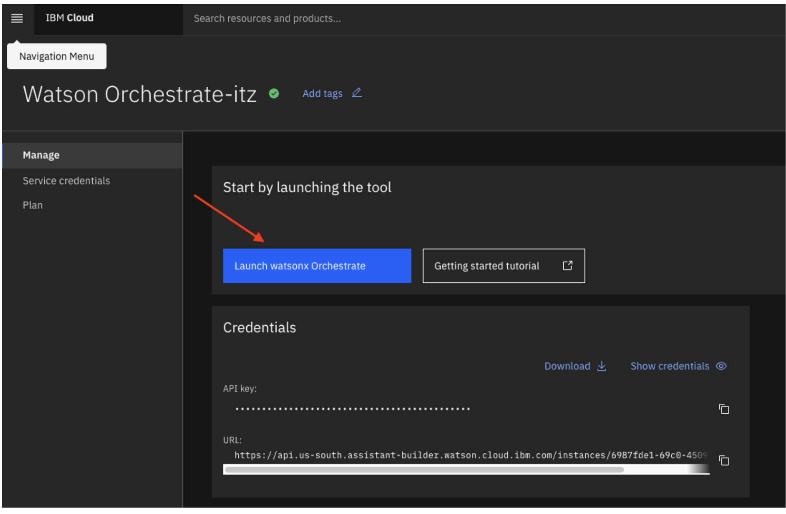
    
- Welcome to watsonx Orchestrate. Open the hamburger menu, click on the down arrow next to **Build**. Then click on **Agent Builder**:
    
    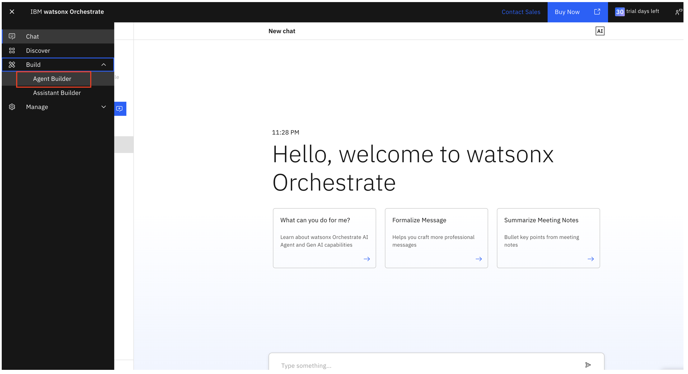
    

### Create HR Agent

1. Click on **Create agent +**:
    
    
    
2. Select **Create from scratch**, give your agent a name, e.g. `HR Agent`, and fill in the **Description** as shown below:
    
    ```
    You are an agent who handles employee HR queries.  You provide short and crisp responses, keeping the output to 200 words or less.  You can help users check their profile data, retrieve latest time off balance, update title or address, and request time off. You can also answer general questions about company benefits.
    ```
    
    Click on **Create**:
    
    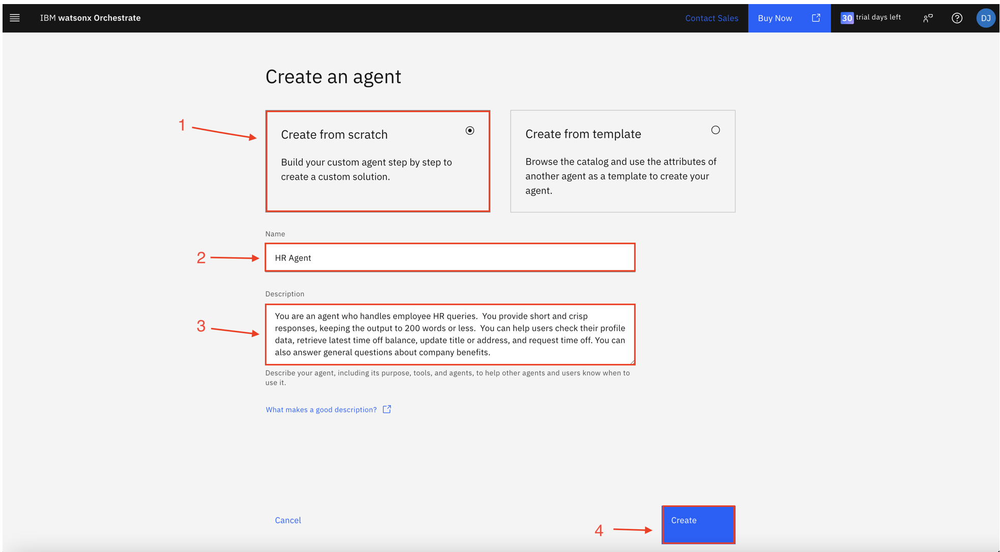
    
3. Select **Default** in **Agent style** section.
    
    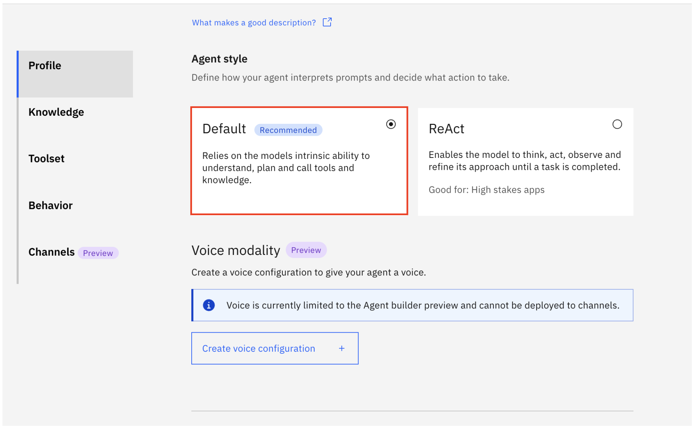
    
4. Scroll down the screen to the **Knowledge** section.
Click on **Choose knowledge**.
    
    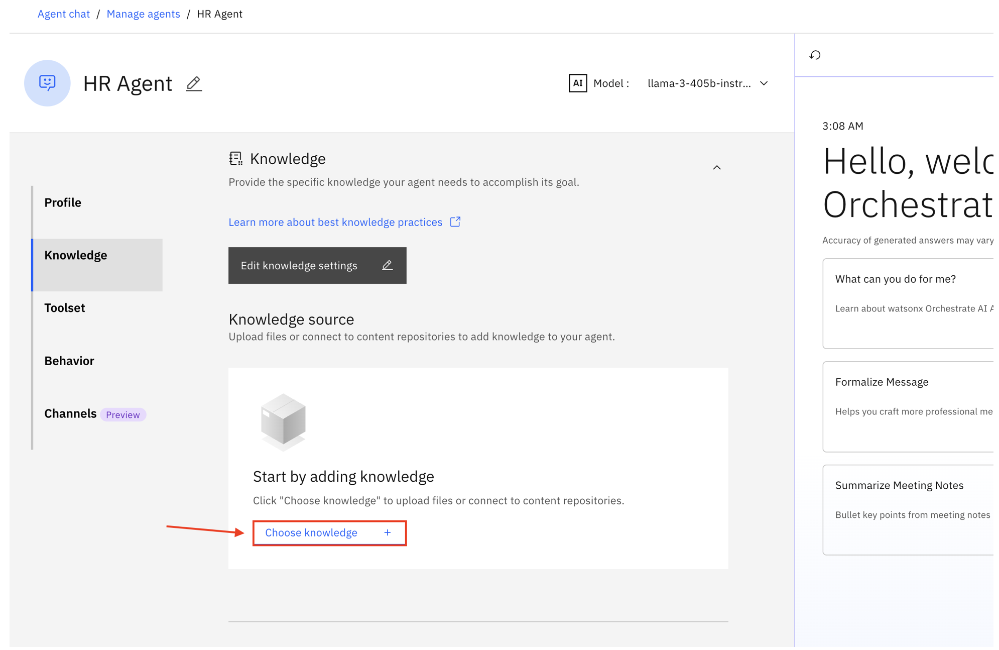
    
5. Select **Upload files**.
Click on **Next**.
    
    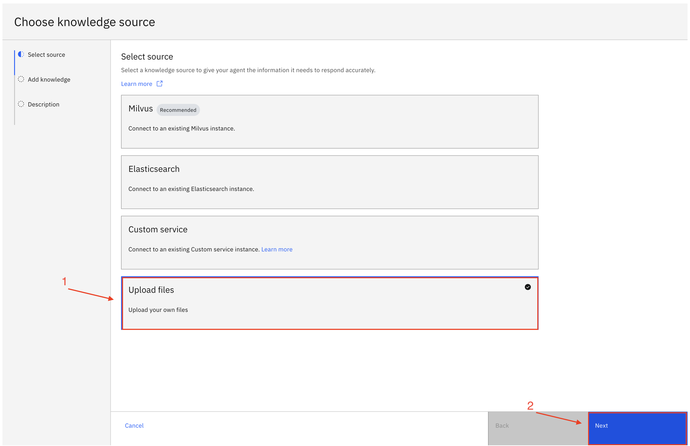
    
6. Download the [Employee Benefits.pdf](/usecases/ask-hr/assets/Employee-Benefits.pdf) onto your system, then upload the file here. You can download the pdf by clicking on [Employee Benefits.pdf](/usecases/ask-hr/assets/Employee-Benefits.pdf) and then click on download icon in opened page as shown in image below.
    
    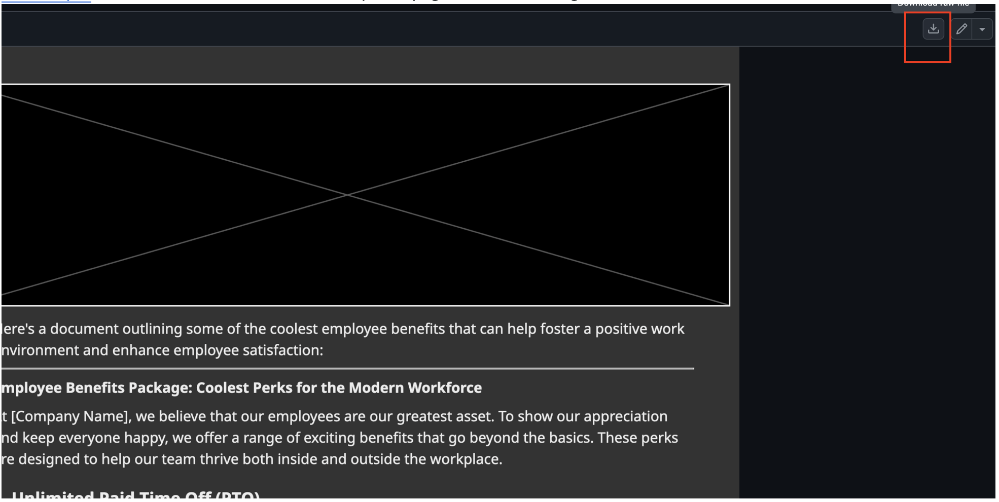
    
    Once you upload the file, Click on **Next**.
    
    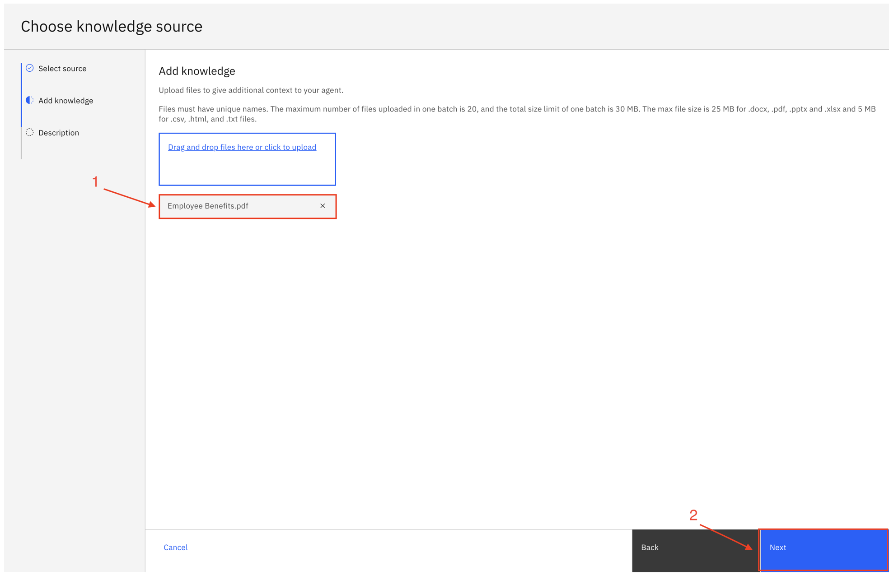
    
7. Copy the following description into the **Description** section and then click on **Save**:
    
    ```
    This knowledge base addresses the company's employee benefits, including parental leaves, pet policy, flexible work arrangements, and student loan repayment.
    ```
    
    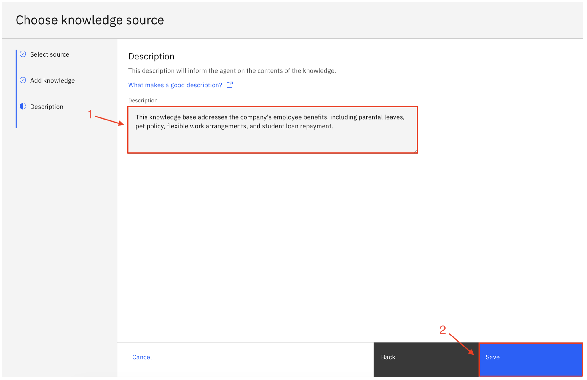
    
8. Scroll down to the **Toolset** section. Click on **Add tool +**:
    
    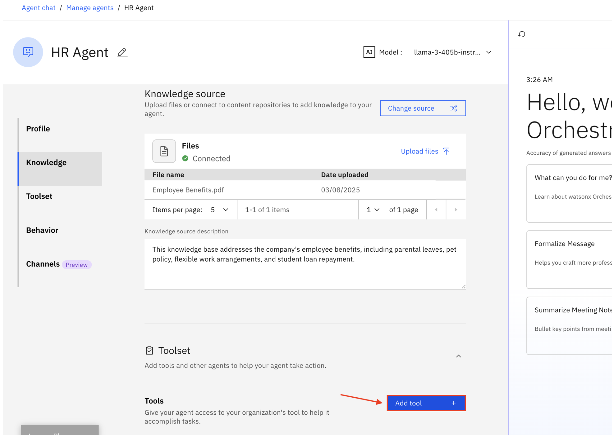
    
9. Select **Add from file or MCP server**:
    
    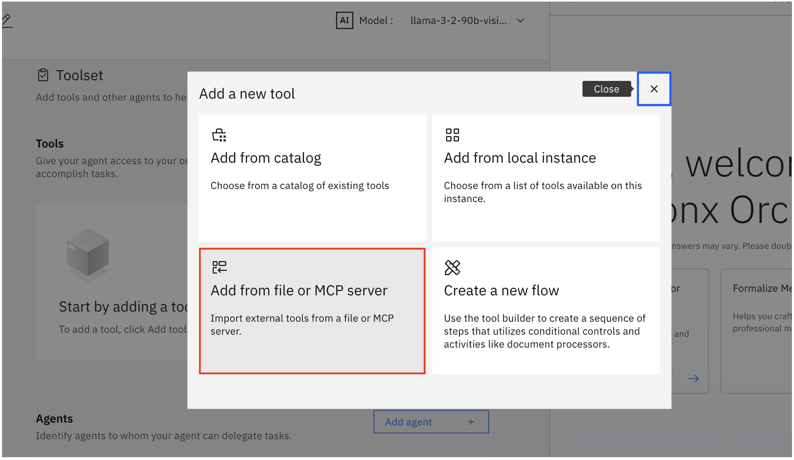
    
10. Select **Import from file**:
    
    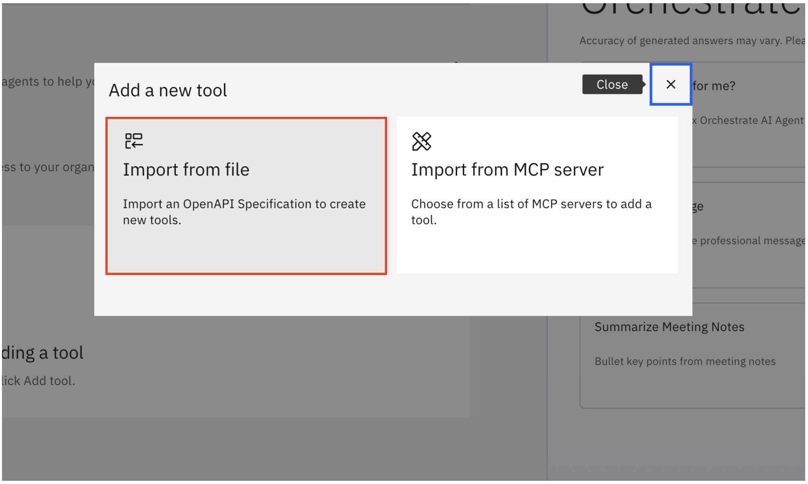
    
11. Drag and drop or click to upload the **hr.yaml** file (provided to you by the instructor), then click on **Next**:
    
    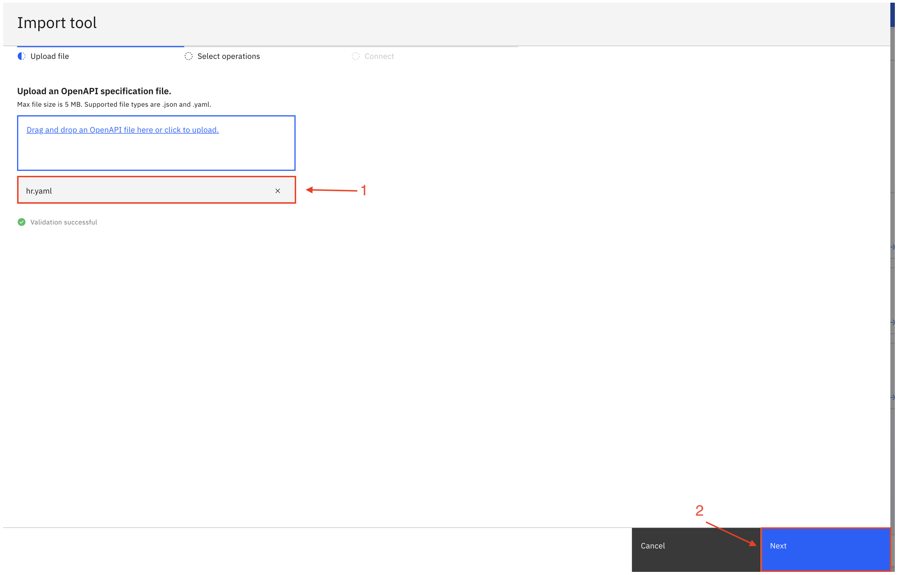
    
12. Select all the operations and click on **Done**:
    
    
    
13. Scroll down to the **Behavior** section. Insert the instructions below into the **Instructions** field:

```
You are an AI assistant that answers questions about employee benefits, and interacts with HR APIs to read or update employee information.

### **Language Behavior**

- If the user speaks in **Spanish**, you must **think and reason internally in English**, but **respond in Spanish**.
- If the user speaks in **English**, you answer in English normally.
- The **first language used by the user determines the language of the entire conversation**:
    - If the user starts in **English → respond ALWAYS in English**
    - If the user starts in **Spanish → respond ALWAYS in Spanish**
- Never translate internal reasoning to the final output.
- Only switch language if the user explicitly asks you to.

---

### RAG Rules (Employee Benefits PDF)

- Use **ONLY AND EXCLUSIVELY** the knowledge retrieved from the knowledge base.
- If information is **not present, incomplete or uncertain**, respond with **"The document does not contain that information."** or provide a similar safe reply.
- **Never invent, assume or exaggerate benefits.**
- Stick strictly to what is written in the Employee Benefits document.

Examples:

❌ "I think they might also offer health insurance."

✔ "The document does not mention health insurance."

---

### Initial Greeting Rule (always)

- On **every first response of a new conversation**, you MUST greet the user and briefly explain:
    - That you are an HR assistant with access to employee benefits knowledge
    - That you can answer benefit-related questions using a knowledge base
    - That you can access and update employee information

---

### API Interaction (hr.yaml endpoints)

Use the HR API ONLY to manage user employee data.

- Use the knowledge base for **benefits queries**, NOT the API.
- Use the API when user wants to:
    - Get user profile
    - Check time-off balance
    - Request time off
    - Update title or address
    - Create user

### Name Handling Memory Rule

When user asks for any profile-related action for the **first time**:

1. First ask for their name (if not already provided)
2. After receiving it, call the corresponding tool
3. Remember the name for the rest of the session without asking again

### Time Off Date Formatting Rule

When user requests time off:

- Convert provided dates to `YYYY-MM-DD` format before calling the API
- Example: "5/22/2025" → "2025-05-22"
```

1. Leave all other settings at default values and click on **Deploy** in the top right corner to deploy your agent:

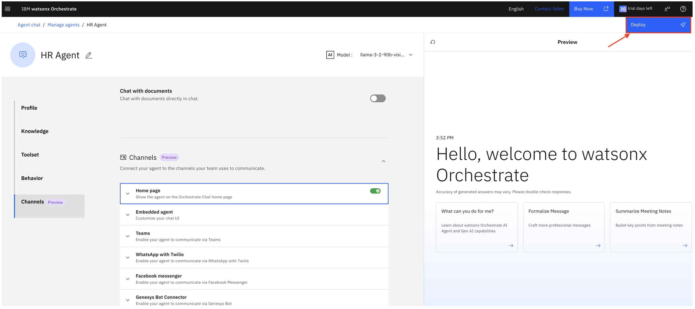

### Test HR Agent in Preview

For this next part, first select an employee name from the list provided by your instructor and use it for your entire session.

Test your agent in the preview chat on the right side by asking the following questions and validating the responses. They should look similar to what is shown in the screenshots below:

```
What is the pet policy?
```


Next try the following prompts and refer to the image below for further interaction with the agent.
Reminder: make sure to select an existing employee name from the list provided by your instructor and use the same employee for the entire session.

```
Show me my profile data.
```

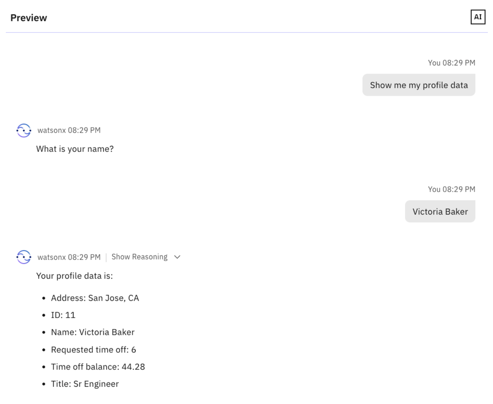

```
I'd like to update my title.
```

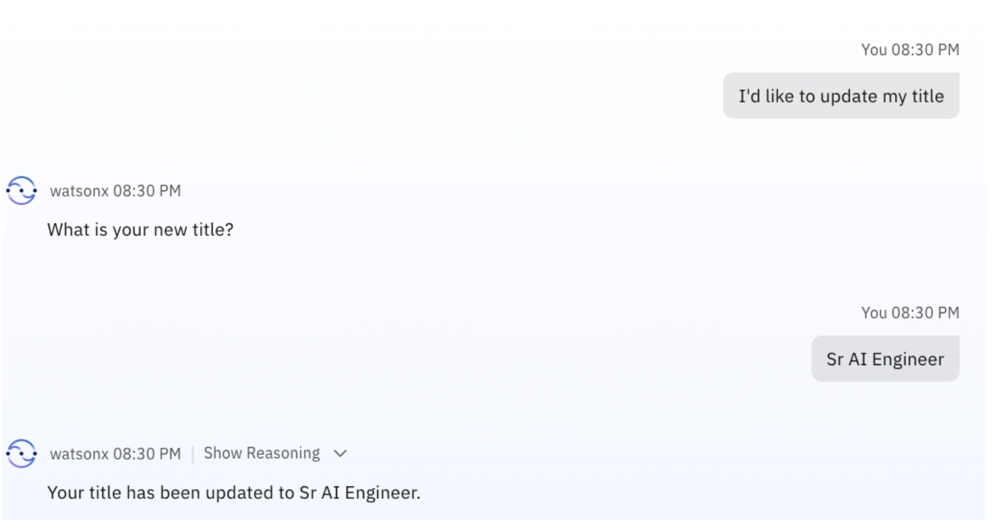

```
Update my address
```

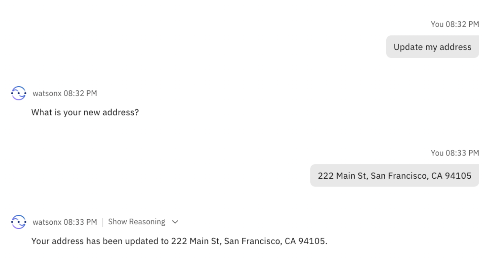

```
What is my time off balance?
```

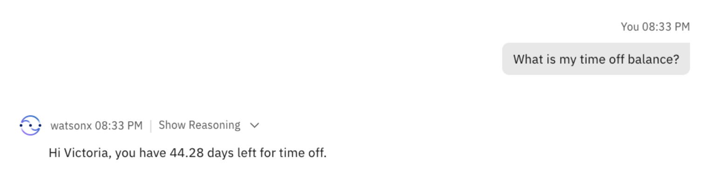

```
Request time off
```

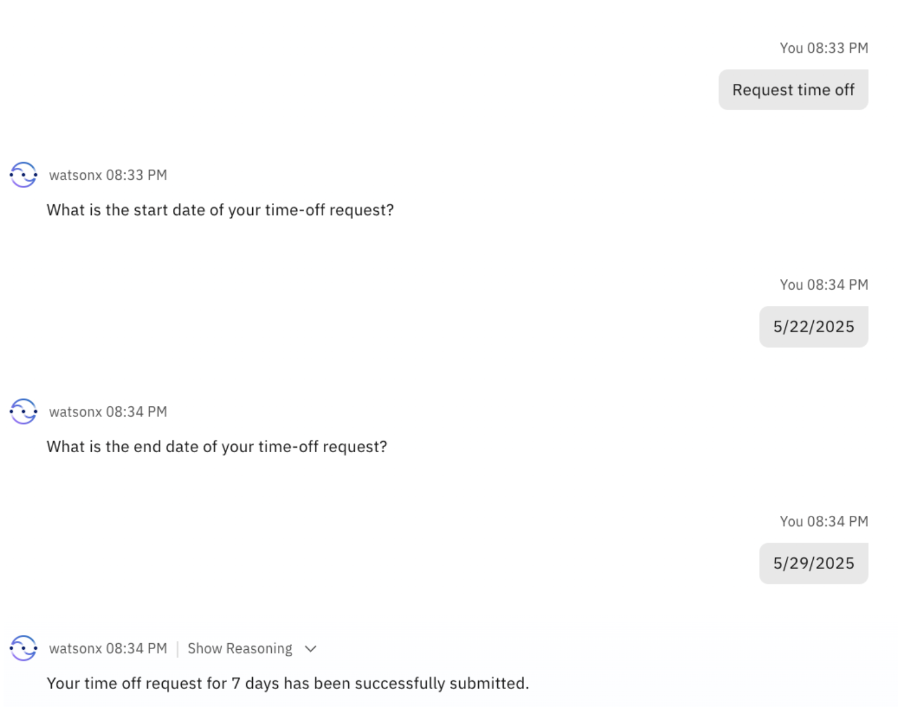

```
Show my profile data.
```

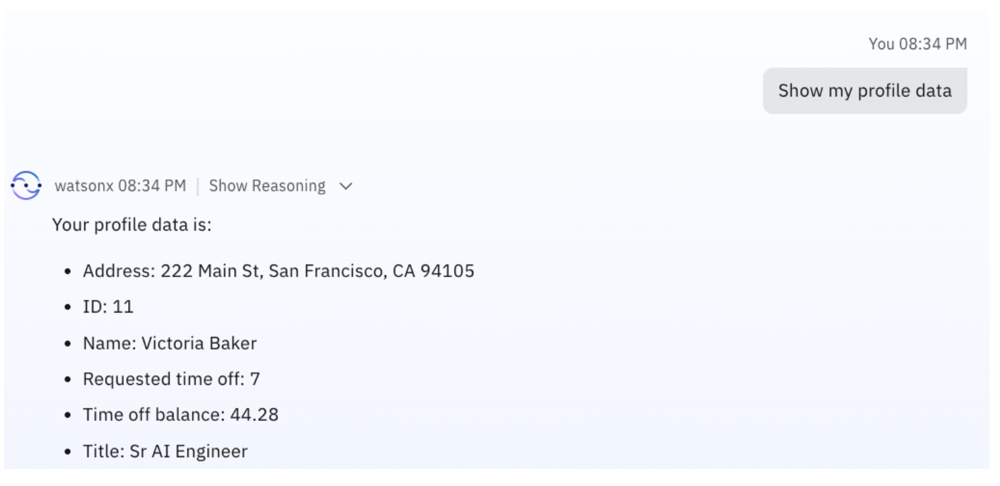

### Test HR Agent AI Chat

Test the Agent from the AI Chat window. Click on the hamburger menu in the top left corner and then click on **Chat**:

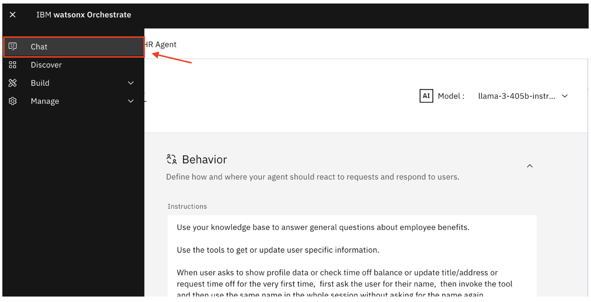

Make sure **HR Agent** is selected. You can now test your agent:

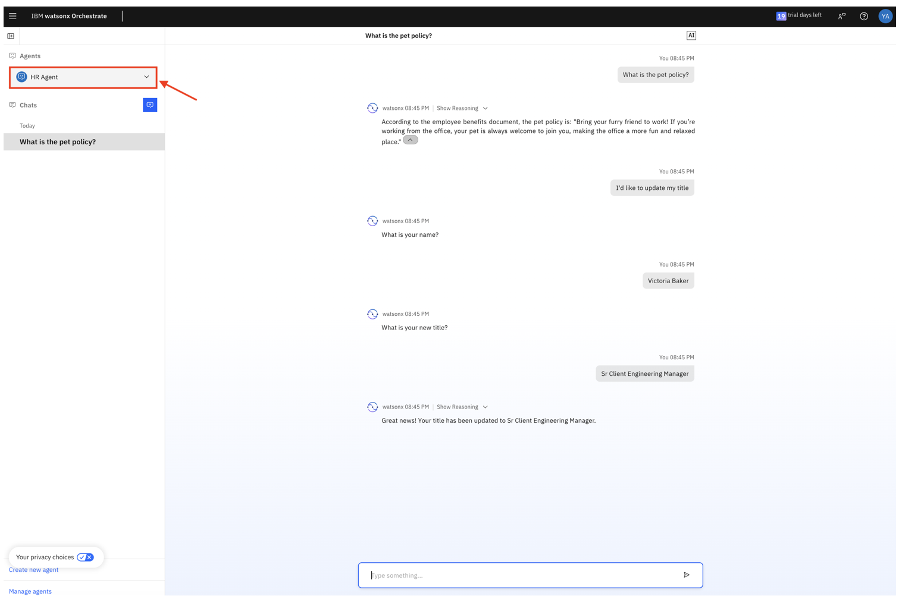